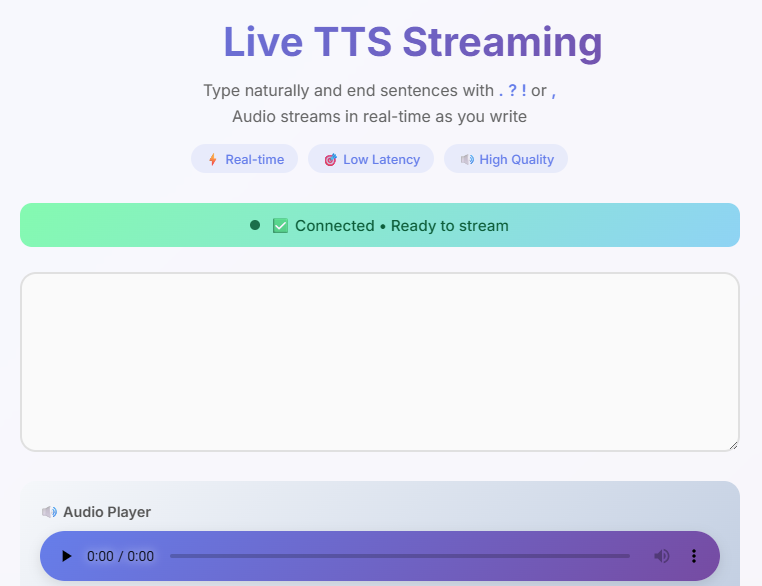
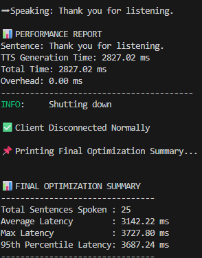
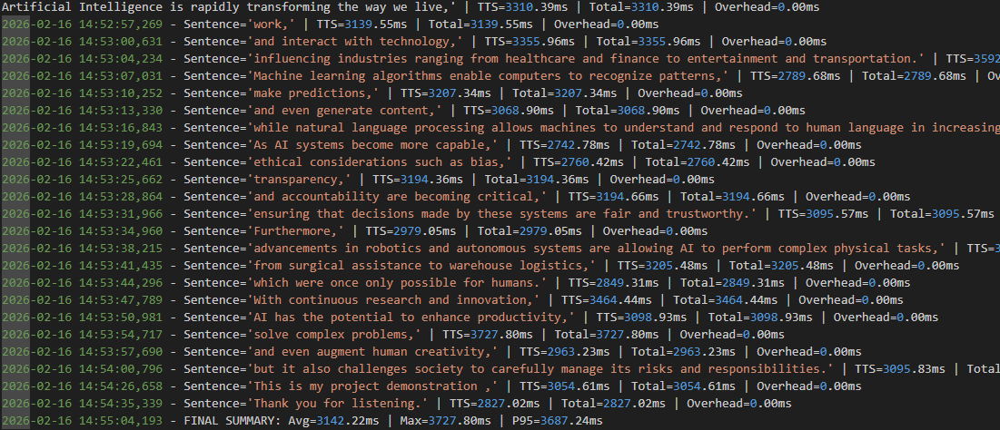

# 🎙 Real-Time Text-to-Speech Streaming (FastAPI + Edge-TTS)

A real-time **chunked Text-to-Speech (TTS) streaming system** built using **FastAPI WebSockets** and **Microsoft Edge-TTS**.

This project allows users to type continuously, and audio is streamed sentence-by-sentence instantly — without waiting for the full text to finish.

---

## 🚀 Features

- ✅ Real-time WebSocket-based TTS streaming  
- ✅ Sentence-level chunking for natural voice breaks  
- ✅ Live audio playback in browser  
- ✅ Heartbeat ping prevents auto disconnect  
- ✅ Latency measurement per chunk  
- ✅ Automatic CSV + log file generation  
- ✅ Final optimization summary printed after disconnect  

---

## 📂 Project Structure

```bash
realtime_tts_stream/
│
├── api.py               # FastAPI WebSocket server
├── tts_engine.py        # Edge-TTS audio generator
├── tts_logger.py        # Latency logging + final summary
├── live.html            # Browser client (real-time audio player)
│
├── logs/                # Auto-generated CSV latency reports
└── tts_metrics.log      # Performance logs

## 📸 Demo Screenshots

### 🎧 Live Streaming Output frrontend


### 📊 Latency report and summary


### 📌 logs

